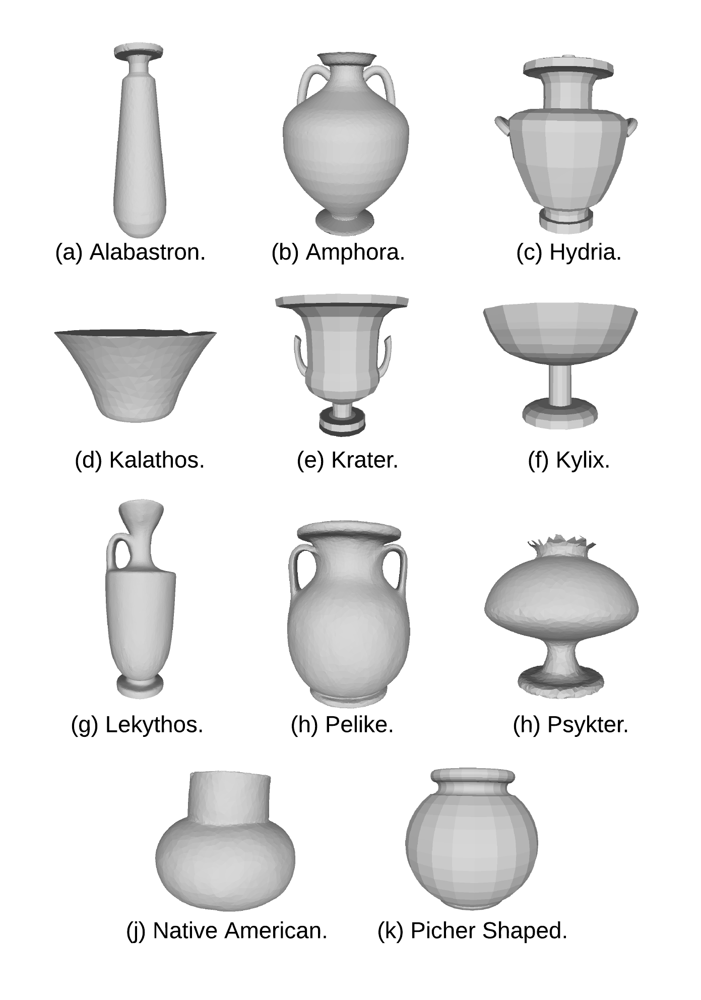
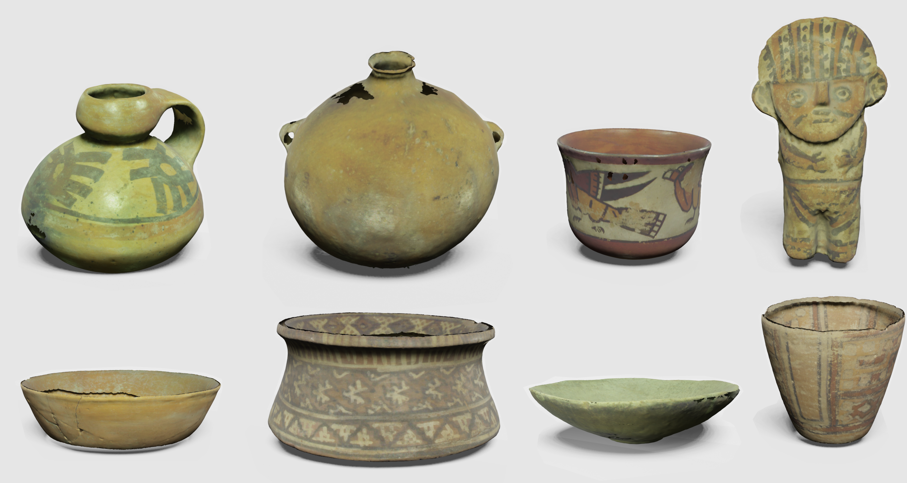
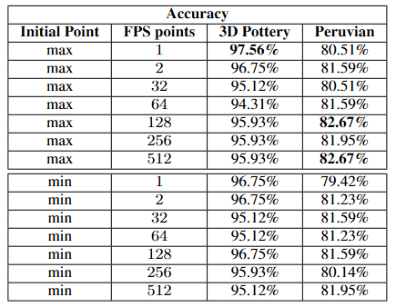
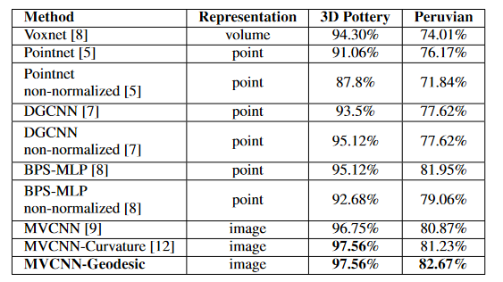

# Classification of ceramics using multi view geodesic farthest point sampling

The source codes were tested on Python 3.6.10 and PyTorch 1.3.1 using GeForce RTX 2080.

<br/>

First, download the datasets according to the method.

- You can download the datasets from console installing gdown.
    ```
    pip install gdown
    ```
    ```
    gdown https://drive.google.com/uc?id=1YifEa4A0eSKLZpp6fWbal-Go-4zvctth
    ```
<br/>
<br/>

## Pottery Dataset 

- [Download Pottery Dataset](https://drive.google.com/uc?id=1yBtEC_Bg_hjqMh-gCaJ-OCazV40fChbn)

<p align="center"> </p>

### Multiview-dataset
- [Normal](https://drive.google.com/uc?id=1YifEa4A0eSKLZpp6fWbal-Go-4zvctth)
- [Curvature](https://drive.google.com/uc?id=1-yieCwBhbM1Wms_rfToUDqt2ZsxW_iKI)
- [Geodesic-max](https://drive.google.com/uc?id=1fgUrM-8dJud3C6U5aJeVYGcduY3yG4yk)
- [Geodesic-min](https://drive.google.com/uc?id=1228-VudFVDHqs_TnslPt4mKkH31ifpHx)
### Point-Cloud-dataset
- [Normalized](https://drive.google.com/uc?id=1ZxgzWpwNQ1x78sgZD2oOlTdqKe8n0B84)
- [Non-Normalized](https://drive.google.com/uc?id=1I3T4BZu06ohvguOzeMsebeNXUxXT0M0u)

## Peruvian Dataset (not available yet )

- [Download Peruvian Dataset](https://drive.google.com/uc?id=)

<p align="center"> </p>

### Multiview-dataset
- [Normal](https://drive.google.com/uc?id=)
- [Curvature](https://drive.google.com/uc?id=)
- [Geodesic-max](https://drive.google.com/uc?id=)
- [Geodesic-min](https://drive.google.com/uc?id=)
### Point-Cloud-dataset
- [Normalized](https://drive.google.com/uc?id=)
- [Non-Normalized](https://drive.google.com/uc?id=)

<br/>

## Run projects

<br/>

### MVCNN (Curvature, Geodesic)
```
cd Sources-Codes/mvcnn_pytorch_$database$/
```
```
python train_mvcnn.py -name mvcnn -num_models 1000 -weight_decay 0.001 -num_views 12 -cnn_name vgg11
```

### BPS-MLP
```
cd Sources-Codes/basis-point-sets/
```
```
python bps_demos/train_modelnet_mlp.py
```

### DGCNN
```
cd Sources-Codes/dgcnn-pytorch/
```
```
python main.py --model=dgcnn
```

### POINTNET
```
cd Sources-Codes/dgcnn-pytorch/
```
```
python main.py --model=pointnet
```

## Results

<br/>

Comparison of the accuracy obtained from the proposed method (MVCNN-Geodesic) with different number of FPS points using the maximum and minimum vertex of the Y-axis as the starting point.
<p align="center"> </p>
<br/>

Comparison of the accuracy obtained from the proposed method (MVCNN-Geodesic) with other classification methods on the two datasets of archaeological ceramics (Peruvian and 3D Pottery). 
<br/>

<p align="center"> </p>